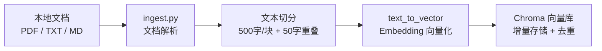
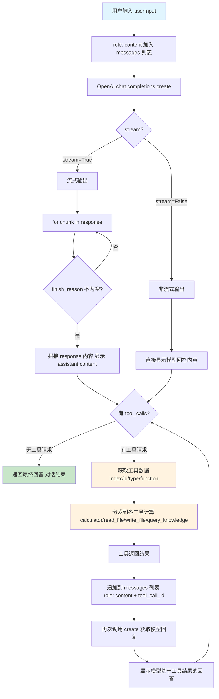
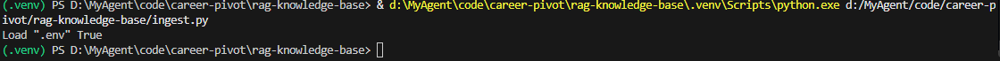
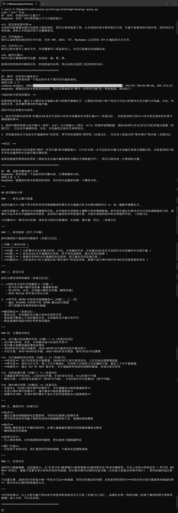
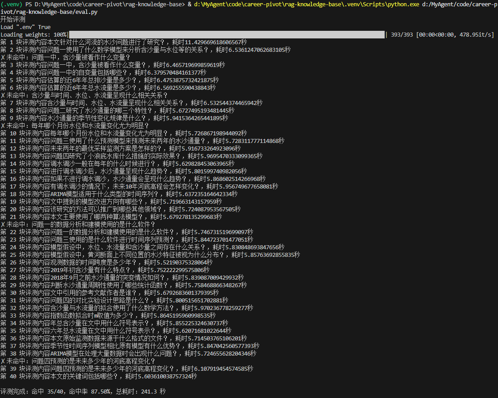
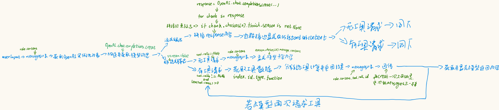

# rag-knowledge-base

本地文档 RAG（检索增强生成）问答系统。支持 PDF / TXT / MD 文档导入，通过向量召回 + 重排序精排 + Function Calling 工具调用，让 DeepSeek 基于私有文档回答问题并标注引用来源。

## 架构图

### 1. 文档导入流（Ingest）



### 2. 问答流（Query）——消息流转详图

对应 `call_llm.py` 中 `call_llm` 的完整执行逻辑：



> 注：若模型再次请求工具，会回到"获取工具数据"节点，形成多轮工具调用循环，直到模型不再请求工具为止。

## 快速开始

### 1. 环境准备

```bash
# 克隆仓库
git clone https://github.com/LiMuBai-QiuWuJi/rag-knowledge-base.git
cd rag-knowledge-base

# 创建虚拟环境
python -m venv .venv
# Windows
.venv\Scripts\activate
# macOS/Linux
source .venv/bin/activate

# 安装依赖
pip install -r requirements.txt
```

### 2. 配置 API Key

```bash
# 创建 .env 文件
touch .env
# Windows PowerShell 用：
# New-Item .env
```

编辑 `.env`，填入你的 DeepSeek API Key：

```env
DEEPSEEK_OPENAI_API_KEY=sk-your-api-key-here
```

### 3. 准备本地 Rerank 模型

下载 [bge-reranker-v2-m3](https://huggingface.co/BAAI/bge-reranker-v2-m3) 模型，放到 `model/` 目录：

```bash
# 目录结构应类似：
# model/BAAI--bge-reranker-v2-m3/snapshots/master/
#   ├── config.json
#   ├── model.safetensors
#   ├── tokenizer.json
#   └── ...
```

### 4. 导入文档

```python
# ingest.py 会自动扫描 data/ 目录下的文档并入库
python ingest.py
```

### 5. 启动问答

```python
python query.py
```

然后输入问题，例如：

```
你：本文针对什么河流的水沙问题进行了研究？
```

## 目录结构

```
rag-knowledge-base/
├── call_llm.py            # LLM 通信统一封装：CallParameters + ChatSession + 工具循环 + 重试
├── ingest.py              # 文档导入：解析 → 切分 → embedding → 存向量库
├── store.py               # 向量库封装（Chroma 增删查）+ bge-reranker 精排
├── query.py               # 问答入口：组装 tool_map 与 CallParameters，调用 call_llm
├── eval.py                # 评测：跑 40 条问答对，算召回命中率
├── config.json            # 模型配置（模型名、温度、max_tokens 等）
├── requirements.txt       # Python 依赖
├── data/                  # 测试文档与评测集
│   ├── eval_set.json      # 40 条评测问答对
│   └── eval_set_answer.txt # 评测输出报告
├── model/                 # 本地 rerank 模型（不进 git）
│   └── BAAI--bge-reranker-v2-m3/
├── .chroma/               # Chroma 向量库数据（不进 git）
├── skill/                 # Function Calling 工具封装
│   ├── calculator/        # 计算器
│   ├── read_file/         # 读文件
│   ├── write_file/        # 写文件
│   └── query_knowledge/   # 知识库查询（默认走 query_and_rerank）
└── README.md
```

## 技术要点

| 模块 | 实现 |
|---|---|
| **Embedding** | 智谱 embedding-2 API |
| **向量库** | Chroma（本地持久化，支持增量更新） |
| **精排** | bge-reranker-v2-m3（CrossEncoder 本地推理） |
| **LLM** | DeepSeek（Function Calling 模式） |
| **工具调用** | 流式/非流式双路径，支持多轮工具循环；tool_map 直传字典分发工具 |
| **上下文管理** | call_llm.py 支持 context_mode（none/recent/unlimited）历史裁剪，控制 token 消耗 |
| **评测** | 40 条问答对关键词匹配，召回命中率 87.5% |

## 运行截图

### 文档导入成功



### 问答对话示例



### 评测结果



### 手绘消息流转图（开发草稿）



## 已知问题

- 5 条未命中评测的问题主要集中在：关键词在原文中出现次数少、位置分散（如"3月"、"MATLAB"仅出现一次）
- 后续可通过增大 `top_k` 或调整切分重叠率进一步优化召回率
